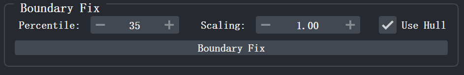
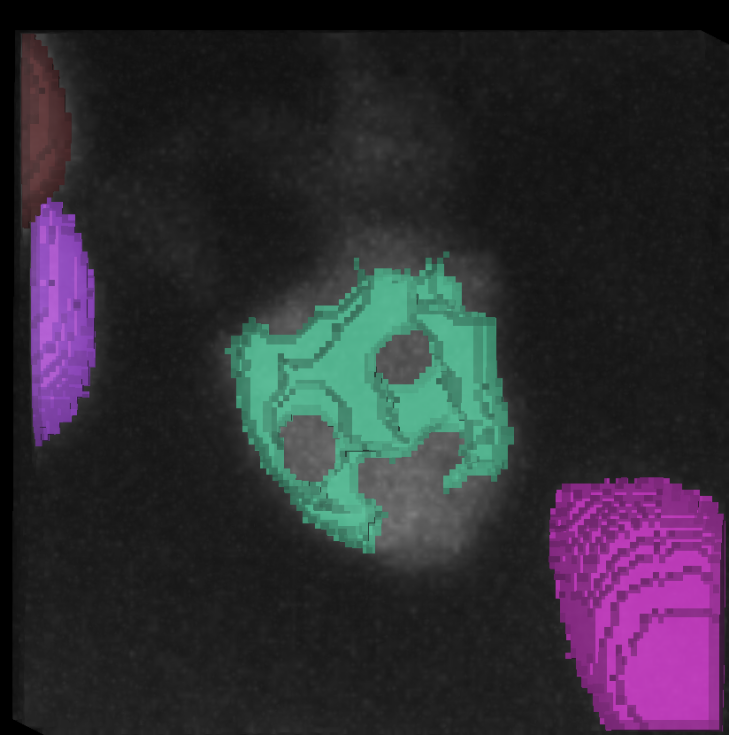
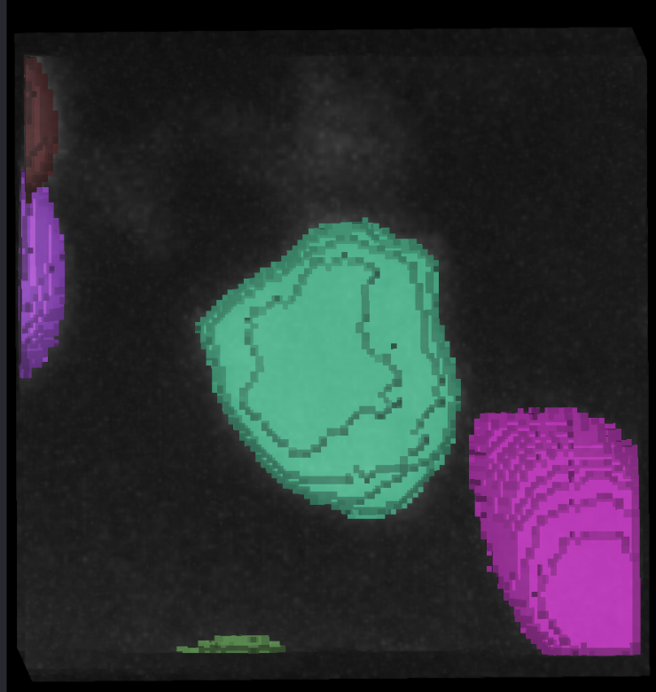

# 六、细胞核边界修复

边界修复用于修正预分割标签与真实细胞核轮廓之间的偏差，例如边界过度扩张侵入背景，或边界收缩导致细胞区域缺失。NuPatch3D 基于局部图像强度信息重新估计细胞边界，并通过形态学后处理生成平滑、连通的细胞掩膜。 相关功能位于插件面板 <kbd>Cell Boundary Refine</kbd> 的 <kbd>Boundary Fix</kbd> 区域。

  
  
图 20. Boundary Fix 面板

完成修复后，需点击 <kbd>Interaction</kbd> 区域中的 <kbd>Commit</kbd> 按钮，或按快捷键 <kbd>Shift</kbd>+<kbd>S</kbd>，将修改结果写回全局 <kbd>Labels</kbd> 图层。否则，修复后的标签仅保存在当前局部编辑区域中，不会同步到全局标签图层。有关提交与保存结果的详细说明，请参阅 [保存结果](save.md)。

## 6.1 设置参数

### Percentile

<kbd>Percentile</kbd> 用于控制边界修复时的强度阈值（默认值：35）。

* 数值越高，保留的高亮区域越少，边界趋于收缩；
* 数值越低，保留的区域越大，边界趋于扩张。

通常情况下：

* 若标签侵入背景区域，可适当提高该值；
* 若标签遗漏了真实细胞边缘，可适当降低该值。

### Scaling

<kbd>Scaling</kbd> 为边界搜索范围的缩放系数（默认值：1.00）。

* 大于 1.0：扩大搜索范围；
* 小于 1.0：缩小搜索范围。

### Use Hull

<kbd>Use Hull</kbd> 用于控制是否启用三维凸包约束（默认启用）。

* 勾选：仅在原始标签凸包附近搜索边界；
* 取消勾选：在细胞的Bounding Box内搜索边界。

对于形状较规则的细胞，建议保持启用；若细胞形状复杂或凸包约束效果不佳，可尝试关闭。

## 6.2 执行修复

确认 <kbd>Label ID</kbd> 中已填写需要修复的标签编号（不支持多个标签）。

根据需要调整： <kbd>Percentile</kbd>；<kbd>Scaling</kbd>；<kbd>Use Hull</kbd>。然后点击 <kbd>Boundary Fix</kbd>。

NuPatch3D 将根据局部原始图像重新计算目标细胞边界，并自动更新 <kbd>LabelFix</kbd> 图层中的标签结果。修复过程仅作用于目标标签及其周围背景区域，不会覆盖邻近细胞。

修复完成后，建议在 2D 或 3D 视图中检查边界与荧光信号的贴合情况。若结果不理想，可调整参数后再次执行 <kbd>Boundary Fix</kbd>。

边界修复通常与 napari 的画笔、橡皮擦等工具配合使用，以获得更精确的结果，详见 [napari 基本操作](napari.md)。

  

    
    
图 21. Boundary Fix 修复前

  

  
→

  

    
    
图 22. Boundary Fix 修复后（结合了画笔精修）

  

