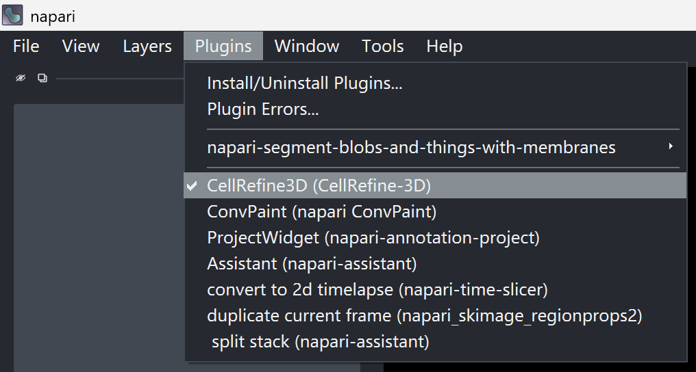
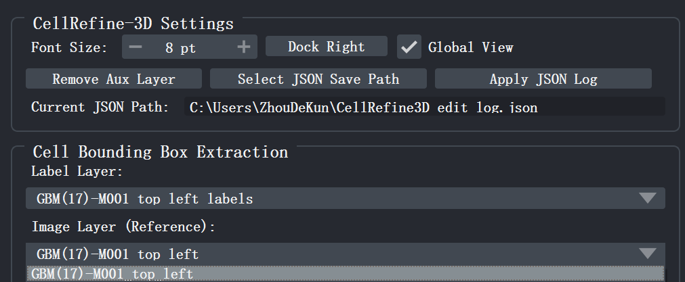

# II. Installation and Setup

## 2.1 System Requirements

- **Operating System**: Windows 10, or macOS 26 (Tahoe) and above
- **Hardware Recommendation**: Intel or AMD processor, 16 GB memory

The above configuration is a verified recommended environment. Other hardware platforms that meet the requirements can also run normally.

## 2.2 Installing CellRefine-3D

CellRefine-3D is a plugin developed on the [napari](https://napari.org/) 3D visualization platform. Before installing this plugin, please ensure that napari is correctly installed and configured, then clone the repository from GitHub and install locally in editable mode:

```bash
# 1. Clone the repository
git clone https://github.com/Hagibis2019/CellRefine3D.git
cd CellRefine3D

# 2. Activate the napari environment (adjust according to your actual environment name)
conda activate napari-env

# 3. Install in editable mode
pip install -e .
```

**Notes**:
- `cd CellRefine3D` means entering the project **root directory** (i.e., the directory containing `setup.py` or `pyproject.toml`), not the `src` subdirectory.
- `-e` (`--editable`) means editable installation: any modification you make to the source code will take effect immediately without re-running `pip install`.

## 2.3 Uninstallation

To uninstall, run the following in the corresponding environment:

```bash
pip uninstall cellrefine3d
```


## 2.4 Launching the CellRefine-3D Plugin

Click the menu bar <kbd>Plugins</kbd> → <kbd>CellRefine3D(CellRefine3D)</kbd>. The plugin panel will dock on the right side of the napari window by default.

<div style="text-align: center; margin: 1.5em 0;">
  
  <div style="color: #666; font-size: 0.9em; margin-top: 0.5em;">Figure 4 Plugin launch control panel</div>
</div>

## 2.5 Confirming Layer Mapping

After the plugin launches, the <kbd>Label Layer</kbd> and <kbd>Image Layer (Reference)</kbd> dropdown boxes in the <kbd>Cell Bounding Box Extraction</kbd> area will automatically recognize available layers in napari. Please manually verify:

- <kbd>Label Layer</kbd> must correspond to the pre-segmentation label layer (<kbd>Labels</kbd> type);
- <kbd>Image Layer (Reference)</kbd> must correspond to the raw fluorescence image layer (<kbd>Image</kbd> type).

If multiple layers of the same type exist (e.g., multiple sets of labels loaded), please manually switch to the target layer currently being edited in the dropdown box.

**Tips**: If <kbd>Label Layer</kbd> cannot be automatically detected, please switch the pre-segmentation label image.

## 2.6 Configuring the Plugin Work Environment

Before any editing operation, it is recommended to first complete the following basic settings in the <kbd>CellRefine-3D Settings</kbd> area (Figure 5):

- **Interface Layout**: If the CellRefine-3D control panel is not on the right side of the napari main window, you can click the <kbd>Dock Right</kbd> button to fix the plugin panel to the right side of the napari main window.
- **Font Adjustment**: If the CellRefine-3D control interface font feels too small, you can adjust the plugin font size in real time through the <kbd>Font Size</kbd> value box.
- **JSON Log Path**: Click <kbd>Select JSON Save Path</kbd> to specify the save location of the operation log. This file is used to record all editing histories and Commit snapshots, and is the key to achieving subsequent traceability and recovery; the default file name is the same as the current <kbd>Image Layer</kbd>. It is strongly recommended to complete this setting before annotation begins, and please do not change it during annotation. After setting, the <kbd>Current JSON Path</kbd> text box will display the effective absolute path.

<div style="text-align: center; margin: 1.5em 0;">
  
  <div style="color: #666; font-size: 0.9em; margin-top: 0.5em;">Figure 5 Plugin basic settings panel</div>
</div>
