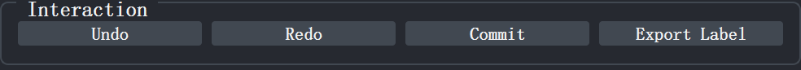

# VIII. Save & Recovery

All editing operations—whether plugin algorithm repairs or native napari annotations—are managed within a unified undo and redo stack, and cached in real time in memory logs. Users can roll back to any historical state at any time, or submit阶段性成果 back to the global original data, exporting as TIFF or serialized JSON logs for complete recovery.

  
  
Figure 26 Interaction panel

## 8.1 Undo and Redo

Click the <kbd>Undo</kbd> button or press the shortcut <kbd>Shift</kbd>+<kbd>Z</kbd> to undo the last operation, restoring label data to its pre-modification state while synchronously rolling back the operation log. Click the <kbd>Redo</kbd> button or press the shortcut <kbd>Shift</kbd>+<kbd>B</kbd> to restore the just-undone operation. The undo and redo stack depth is 10 steps, covering all modification types including algorithm repairs and manual painting.

## 8.2 Committing Changes

When editing in the local <kbd>LabelFix</kbd> reaches a阶段性成果 worth saving, click the <kbd>Commit</kbd> button or press the shortcut <kbd>Shift</kbd>+<kbd>S</kbd>. The plugin performs the following actions:

- Writes the local label data from the current <kbd>LabelFix</kbd> back to the global original <kbd>Labels</kbd> layer at the <code>current bounding box</code> position;
- Automatically generates a <code>CommitSnapshot</code> entry, recording the complete voxel state, coordinate range, time, and layer mapping relationship within the <code>bounding box</code> at that moment;
- Appends all cached intermediate operation logs since the start of this session (including native paintbrush, eraser, fill bucket events, and algorithm repair records) along with this Commit snapshot to the JSON log file;
- Clears the cached logs in memory, starting a new recording cycle;
- Automatically re-extracts the <code>bounding box</code> for the current <kbd>Label ID</kbd>, refreshing the local view to continue the next round of editing.

**Note**:

- JSON logs use append mode; historical records will not be overwritten.
- For every correct operation performed, be sure to Commit to save that operation.

## 8.3 Exporting Labels

Click <kbd>Export Label</kbd> to export the currently modified label layer in TIFF format. When exporting, the global original label layer is saved with priority (if it has been Committed back). The file name is appended with `_refined` to the original layer name by default, and the save directory is consistent with the current JSON path directory; if the file already exists, a pop-up will ask whether to overwrite. Alternatively, you can use <kbd>Ctrl</kbd>+<kbd>S</kbd> or napari's native <kbd>File</kbd> → <kbd>Save Selected Layers</kbd>.

## 8.4 Applying JSON Logs

When encountering abnormal program exit, accidental label data loss, or needing to fully reproduce a previous refinement workflow, simply use the original image and initial pre-segmentation labels together with the JSON log to reconstruct all work. Click <kbd>Apply JSON Log</kbd> and select the JSON log file generated by this plugin. The plugin parses all <code>CommitSnapshot</code> entries in chronological order, verifies <code>bounding box</code> shape and target layer compatibility, and then precisely writes the voxel-level label data from each snapshot back to the corresponding global <kbd>Labels</kbd> layer. If the original layer name recorded in the JSON does not match the layer name currently in napari, the plugin will automatically match candidate layers by <code>bounding box</code> shape and voxel dimensions, or pop up a window for manual user selection.