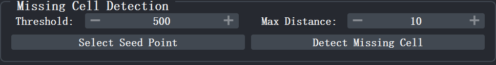
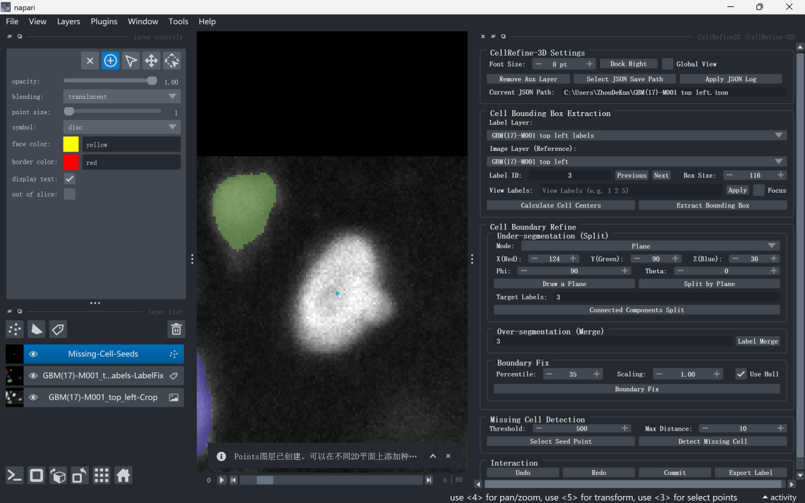
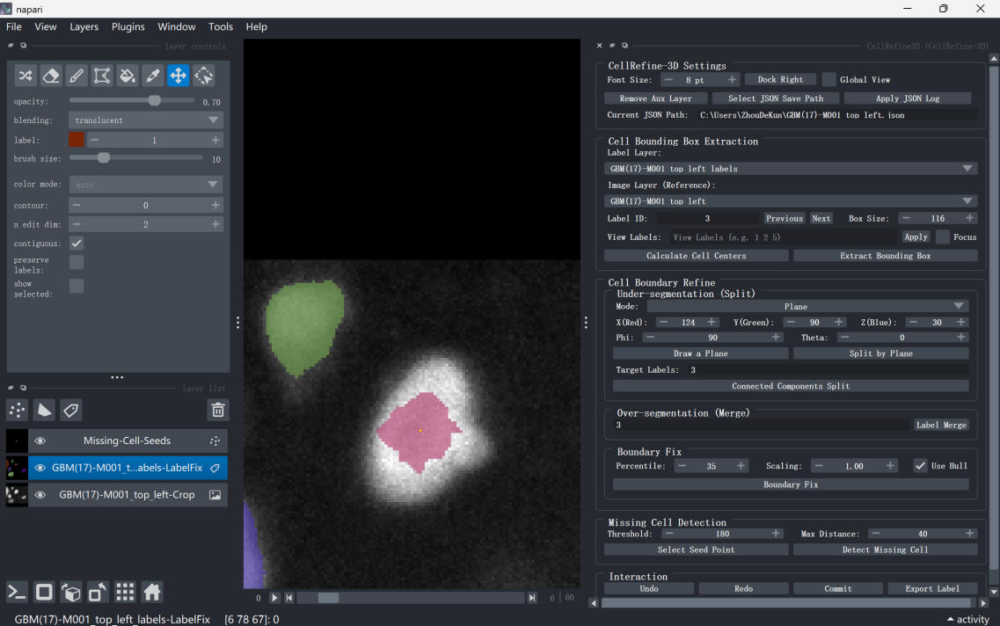

# Detecting Missing Cells

Missing cell detection is used to identify real cells omitted from the pre-segmentation result—that is, regions where obvious fluorescence signals exist in the image but no label has been assigned. NuPatch3D automatically generates new cell labels based on the watershed algorithm, starting from user-specified seed points. The relevant functions are located in the <kbd>Missing Cell Detection</kbd> region of the plugin panel.

  
  
Figure 23. Missing Cell Detection Panel

After detection is completed, you must click the <kbd>Commit</kbd> button in the <kbd>Interaction</kbd> region, or press the shortcut <kbd>Shift</kbd>+<kbd>S</kbd>, to write the modified results back to the global <kbd>Labels</kbd> layer. Otherwise, the newly generated labels will only be saved in the current local editing region and will not be synchronized to the global label layer. For detailed instructions on committing and saving results, please refer to [Saving Results](save.md).

## 7.1 Place Seed Points

Click <kbd>Select Seed Point</kbd>. If no seed point layer currently exists, NuPatch3D will automatically create the <kbd>Missing-Cell-Seeds</kbd> layer (yellow <kbd>Points</kbd>) and enter point selection mode. At this point, switch to the 2D view and place seed points at the centers of fluorescence signals of suspected missed cells. Each seed point corresponds to a candidate cell region to be detected. Multiple seed points can be placed simultaneously, and NuPatch3D will process them sequentially. After detection is completed, auxiliary points and related layers can be deleted via the shortcut <kbd>Shift</kbd>+<kbd>C</kbd>.

## 7.2 Set Parameters

### Threshold

<kbd>Threshold</kbd> is the foreground detection threshold (default: 500). Higher values retain stronger fluorescence signals.

If the detection result contains too much noise, appropriately increase this value; if the missed cell signal is weak, appropriately decrease this value.

### Max Distance

<kbd>Max Distance</kbd> is the maximum growth distance of the watershed (default: 10 pixels). Larger values cause the new label to expand farther outward.

For larger cells, appropriately increase this value; for dense cell regions, it is recommended to keep a smaller value to avoid erroneous expansion.

## 7.3 Execute Detection

Confirm that at least one seed point has been placed in the <kbd>Missing-Cell-Seeds</kbd> layer, and adjust the <kbd>Threshold</kbd> and <kbd>Max Distance</kbd> parameters as needed.

Click <kbd>Detect Missing Cell</kbd>. NuPatch3D will automatically execute watershed segmentation based on the seed point positions, and assign new label IDs to the detected new regions.

Under normal circumstances, each seed point corresponds to a new label. Since watershed results may deviate from the true cell boundaries, it is recommended to further refine new labels using [Boundary Refinement](boundary.md) after detection is completed.

  
  
Figure 24. Seed Point Placement Example

  
  
Figure 25. Missing Cell Detection Result Example

