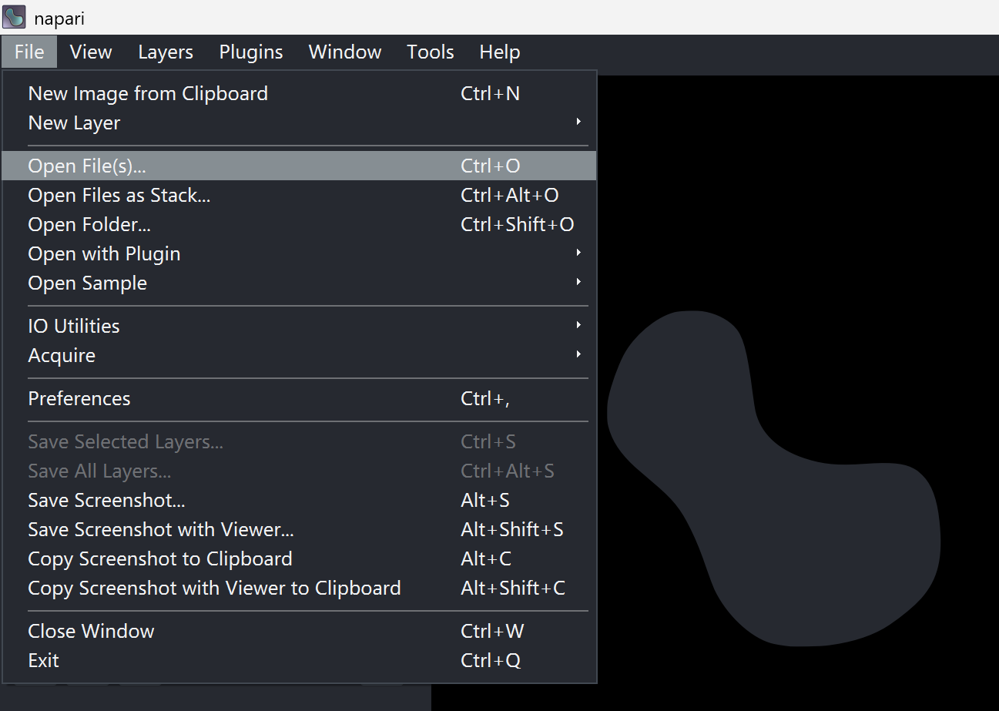
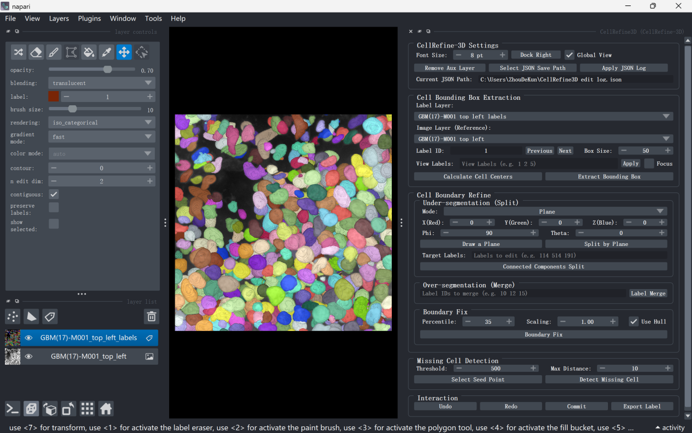
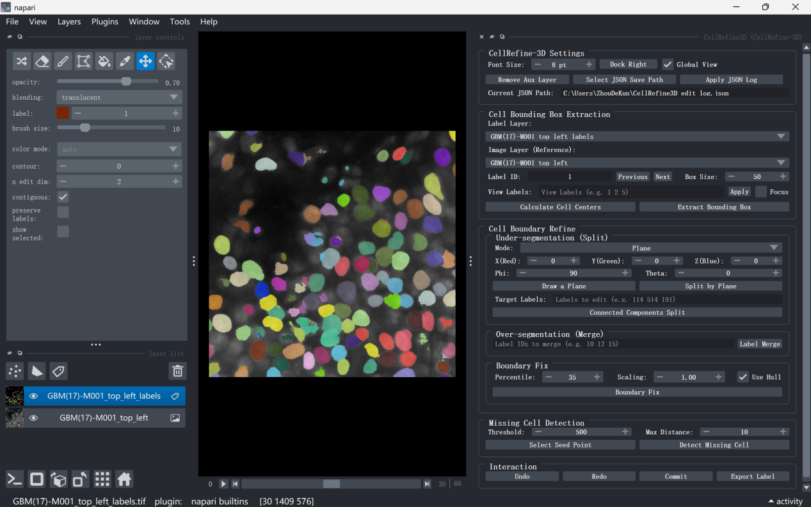

# Basic napari Operations

This section introduces the basic [napari](https://napari.org/) operations required when using NuPatch3D. For the full functionality and detailed usage of napari, please refer to the [napari official documentation](https://napari.org/stable/).


## 1.1 Installation and Launch

If napari is not yet installed, please run the following command in the target Python environment (note: this plugin is adapted and tested for napari 0.6; other versions may have compatibility issues):

```bash
pip install "napari[all]"
```
After installation, launch napari by running the following command in the terminal:

```bash
napari
```

After successful launch, the napari main window will open.

## 1.2 Data Loading

After launching napari, you can load TIFF format original fluorescence images and pre-segmented label images via the menu bar **File → Open Files** (see Figure 1); you can also drag and drop paired TIFF files directly into the napari window to complete loading.

After successful loading, the left layer panel will display the following two layers:

* <kbd>Image</kbd>: Original fluorescence image
* <kbd>Labels</kbd>: Pre-segmented label image

> **Note**
>
> NuPatch3D requires both the original fluorescence image (TIFF) and the pre-segmented label image (TIFF) to be loaded. Missing either file will prevent normal use of the plugin functions.

<div style="text-align: center; margin: 1.5em 0;">
  
  <div style="color: #666; font-size: 0.9em; margin-top: 0.5em;">Figure 1. Data Loading Control Panel</div>
</div>

## 1.3 View

### 2D / 3D View Toggle

Click the <kbd>2D / 3D</kbd> button in the lower-left corner of the canvas to switch between 2D slice view and 3D volume rendering view.

### Slice Browsing

In 2D view, drag the <kbd>Z / Y / X</kbd> sliders at the bottom or left to browse different slices layer by layer.

### 3D View Operations

After switching to 3D view:

* Hold the left mouse button and drag to rotate the view;
* Scroll the mouse wheel to zoom the view.

> **Tip**
>
> After extracting the cell neighborhood, it is recommended to first rotate and observe the target cell and its neighborhood structure in the 3D view to confirm segmentation quality before performing local editing. For the specific operation workflow, please refer to [Basic Operations of NuPatch3D](loading.md).
>

<div style="text-align: center; margin: 1.5em 0;">
  
  <div style="color: #666; font-size: 0.9em; margin-top: 0.5em;">Figure 2. 3D View</div>
</div>

<div style="text-align: center; margin: 1.5em 0;">
  
  <div style="color: #666; font-size: 0.9em; margin-top: 0.5em;">Figure 3. 2D View</div>
</div>


## 1.4 Annotation Tools

napari provides a variety of native annotation tools, which can be selected through the toolbar in the upper-left corner of the interface, or switched via shortcuts.

| Tool | Shortcut | Function |
| ---- | -------- | -------- |
| Paint Brush | <kbd>P</kbd> | Draw foreground labels on the Labels layer |
| Eraser | <kbd>E</kbd> | Erase annotated voxels |
| Fill | <kbd>F</kbd> | Fill connected regions |

> **Note**
>
> Before using annotation tools, please ensure that the current selected layer is <kbd>Labels</kbd>, not <kbd>Image</kbd>.
>
> napari native annotation operations support <kbd>Ctrl</kbd>+<kbd>Z</kbd> undo.

NuPatch3D's local editing functions are fully compatible with the above native tools. For example, you can first use the eraser to remove erroneous bridges, and then execute the plugin's connected components relabeling function to fix under-segmentation issues (see [Under-segmentation Refinement](under.md)); you can also use the brush to supplement labels in boundary-missing regions, and then invoke the density-constrained boundary refinement function (see [Boundary Refinement](boundary.md)).

All annotation operations, including napari's native annotation tools, are incorporated into NuPatch3D's unified editing history management mechanism and recorded in the JSON operation log. Users can use the undo, redo, and restore functions provided by the plugin to achieve traceability and recovery of voxel-level editing processes. For detailed instructions, please refer to [Restoring Results](restore.md).

## 1.5 Layer Management

Common layer management operations are as follows:

* **Show/Hide Layer**: Click the eye icon to the left of the layer name in the Layer List.
* **Adjust Opacity**: Drag the **Opacity** slider in the layer properties panel.
* **Delete Layer**: After selecting the target layer, click the trash can icon at the bottom of the layer list.

After NuPatch3D extracts the local editing region, the following layers are automatically created:

* `<ImageName>-Crop`: Local original image;
* `<ImageName>-LabelFix`: Local label image.

Users can switch between global and local views via the <kbd>Global View</kbd> toggle to focus on the current editing region and avoid accidentally modifying other cells. For detailed instructions, please refer to [Basic Operations of NuPatch3D](loading.md).

---

> **Tip**
>
> This chapter only introduces the basic napari functions required for using NuPatch3D. For advanced features such as multi-channel images, time-series data, and the plugin system, please refer to the [napari official documentation](https://napari.org/stable/).
