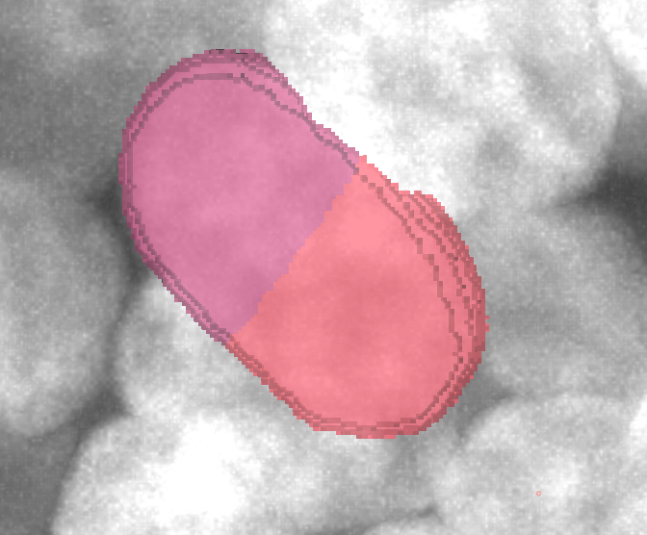
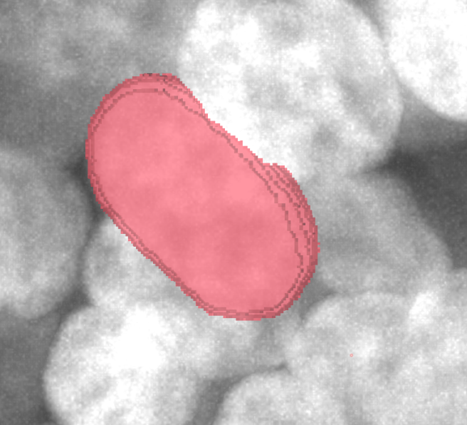

# Over-segmentation Merge

Over-segmentation refers to a single cell being incorrectly divided into multiple independent labels. NuPatch3D provides label merging functionality, which can merge multiple labels into one label, or directly delete labels of non-existent cells. The relevant operations are located in the <kbd>Over-segmentation (Merge)</kbd> region of the <kbd>Cell Boundary Refine</kbd> panel.

<div style="text-align: center; margin: 1.5em 0;">
  
  <div style="color: #666; font-size: 0.9em; margin-top: 0.5em;">Figure 17. Over-segmentation Merge Panel</div>
</div>

<div style="text-align: center; margin: 2em 0;">
  <div style="display: inline-block; vertical-align: middle; text-align: center; width: 280px; margin: 0 15px;">
    
    <div style="color: #666; font-size: 0.9em; margin-top: 0.5em;">Figure 18. Before Merge Example</div>
  </div>
  <div style="display: inline-block; vertical-align: middle; font-size: 2.5em; color: #888; margin: 0 5px;">→</div>
  <div style="display: inline-block; vertical-align: middle; text-align: center; width: 280px; margin: 0 15px;">
    
    <div style="color: #666; font-size: 0.9em; margin-top: 0.5em;">Figure 19. After Merge Example</div>
  </div>
</div>

After label merging, you must click the <kbd>Commit</kbd> button in the <kbd>Interaction</kbd> region, or press the shortcut <kbd>Shift</kbd>+<kbd>S</kbd>, to write the modified results back to the global <kbd>Labels</kbd> layer. Otherwise, the repaired labels will only be saved in the current local editing region and will not be synchronized to the global label layer. For detailed instructions on committing and saving results, please refer to [Saving Results](save.md).

## 5.1 Multi-label Merge

Enter the label IDs to be merged in the <kbd>Label IDs to Merge</kbd> input box. Multiple labels are separated by spaces, for example:

```text
10 12 15
```
After clicking <kbd>Label Merge</kbd>, NuPatch3D will merge all selected labels into the same label, retaining the smallest label ID among them.

## 5.2 Delete Non-existent Cell Labels

If only a single non-zero label ID is entered in <kbd>Label IDs to Merge</kbd>, for example:

```text
10
```

After clicking <kbd>Label Merge</kbd>, NuPatch3D will set all voxels corresponding to this label to background (label value 0), effectively deleting that region from the segmentation result.
