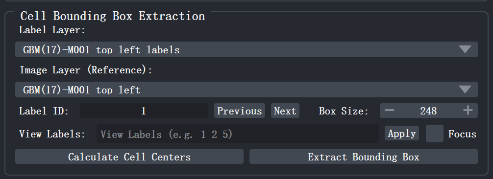
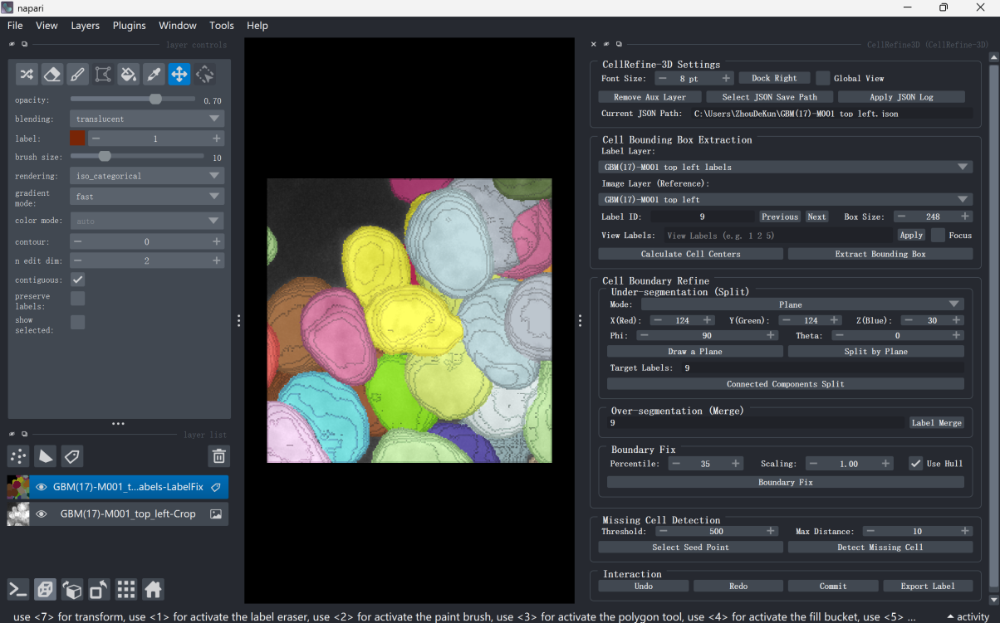
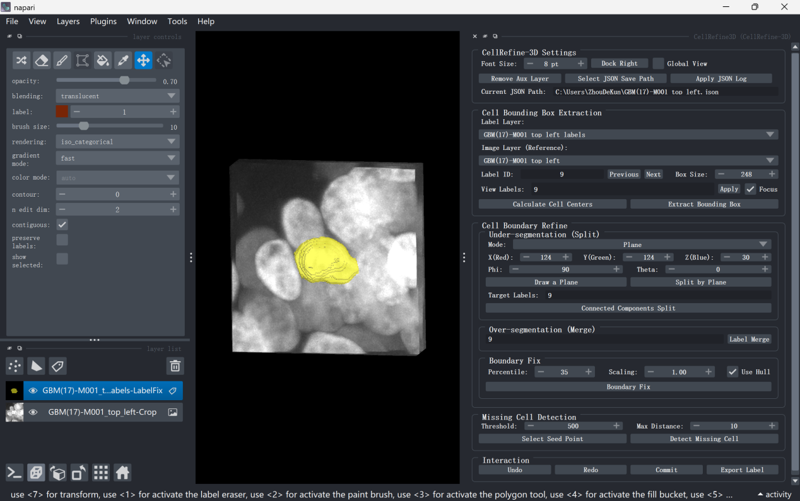

# 三、CellRefine-3D 的基本操作

插件所有精修操作均围绕局部邻域（Bounding Box）展开。用户从全局标签中指定目标细胞，裁剪出包含该细胞的局部立方体，后续的分裂、合并、边界修复与手动修正均在此局部区域内完成，避免误改全局其他细胞。

  
  
图 6 Cell Bounding Box Extraction 面板

## 3.1 计算细胞中心

在插件面板 <kbd>Cell Bounding Box Extraction</kbd> 控制模块，点击 <kbd>Calculate Cell Centers</kbd>。插件将为全局标签图中所有非零标签计算三维空间中心坐标，并建立标签索引。

计算完成后，插件会自动根据当前 <kbd>Label ID</kbd> 对应细胞的实际直径，并将每个细胞的 <kbd>Box Size</kbd> 初始化设置为其直径的 2 倍，以确保裁剪区域既能完整包裹目标细胞，又不过度包含无关邻域。

## 3.2 设定目标标签与裁剪尺寸

在 <kbd>Label ID</kbd> 输入框中填入需要编辑的目标标签编号，或通过 <kbd>Previous</kbd> / <kbd>Next</kbd> 按钮按标签中心列表顺序前后切换。插件支持键盘快捷键快速导航：按 <kbd>A</kbd> 键切换到上一个标签，按 <kbd>D</kbd> 键切换到下一个标签。可在 <kbd>Box Size</kbd> 数值框手动调整裁剪立方体的边长（单位：像素）。

## 3.3 提取局部编辑区域

点击 <kbd>Extract Bounding Box</kbd>，插件从全局标签与原始图像中同步裁剪出以目标细胞为中心的局部区域，并在 napari 中生成两个新图层：

- <code>原图片名-Crop</code>：局部原始图像（<kbd>Image</kbd> 类型），作为后续修改的主要参考图像；
- <code>原图片名-LabelFix</code>：局部可编辑标签（<kbd>Labels</kbd> 类型），所有后续精修操作均在此图层上进行。

提取完成后，插件会自动取消 <kbd>Global View</kbd> 勾选，将原始全局图层从视图中移除，仅保留局部 <kbd>LabelFix</kbd> 与 <kbd>Crop</kbd> 图层，防止全局其他细胞干扰局部编辑。此时可利用 napari 基础视图功能旋转、缩放或逐层浏览该局部区域，确认分割质量。

  
  
图 7 提取细胞邻域后软件界面

## 3.4 视图标签过滤

<kbd>View Labels</kbd> 输入框中填写需要保留显示的标签编号（以空格分隔），点击 <kbd>Apply</kbd> 生效。<kbd>Apply</kbd> 执行后会自动激活 <kbd>Focus</kbd> 模式：此时仅保留 <kbd>View Labels</kbd> 中指定的标签可见，其余标签隐藏；若 <kbd>View Labels</kbd> 留空，则默认仅当前 <kbd>Label ID</kbd> 指定的标签可见。

<kbd>Focus</kbd> 复选框是一个独立的显示开关——取消勾选即恢复显示全部标签，再次勾选则回到聚焦状态。按快捷键 <kbd>F</kbd> 可在聚焦与全部显示之间快速切换，便于在局部分析与整体观察之间灵活跳转。此外，按 <kbd>Shift</kbd>+<kbd>R</kbd> 可在"显示全部标签"与"仅 <kbd>View Labels</kbd> 指定标签"之间切换，与 <kbd>Apply</kbd> 按钮效果等价。

  
  
图 8 视图标签过滤后软件界面

## 3.5 全局视图切换

如需在编辑过程中随时对照全局原始数据，可勾选插件顶部 <kbd>Settings</kbd> 区域的 <kbd>Global View</kbd> 复选框，原始全局 <kbd>Image</kbd> 与 <kbd>Labels</kbd> 图层将重新显示于 napari 视图中。再次取消勾选则恢复仅显示局部 <kbd>LabelFix</kbd> 与 <kbd>Crop</kbd> 图层。

## 3.6 清理辅助图层

在使用 Plane 分割、Manual 选点、Missing Cell Detection 或三维视图导航后，napari <kbd>Layers</kbd> 面板中可能残留 <kbd>Plane Label Splitting-Points</kbd>、<kbd>Plane Label Splitting-Shapes</kbd>、<kbd>Plane-Spherical-Axes</kbd>、<kbd>GMM-Coordinates</kbd>、<kbd>Missing-Cell-Seeds</kbd> 等辅助图层，详见[欠分割](under.md)。点击插件顶部 <kbd>Settings</kbd> 区域的 <kbd>Remove Aux Layer</kbd> 按钮，或按快捷键 <kbd>Shift</kbd>+<kbd>C</kbd>，可一键删除所有由插件创建的辅助图层，并将活动焦点自动重置到当前编辑图层，避免影响后续操作。
