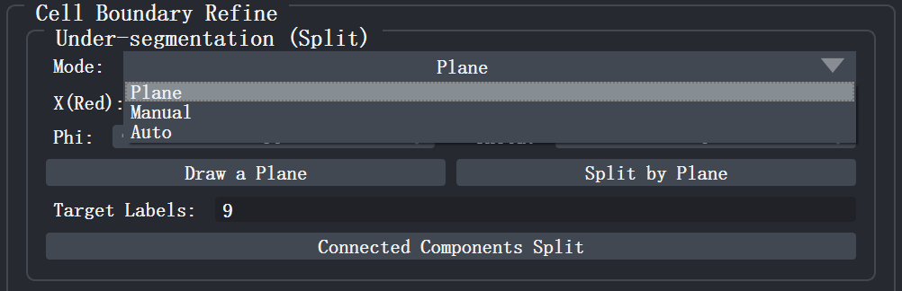
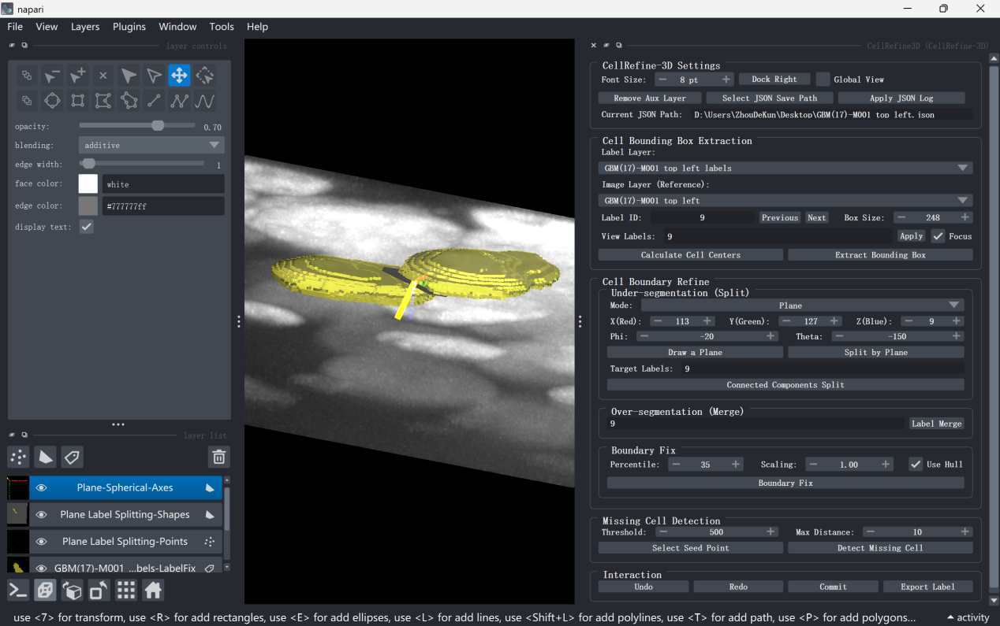
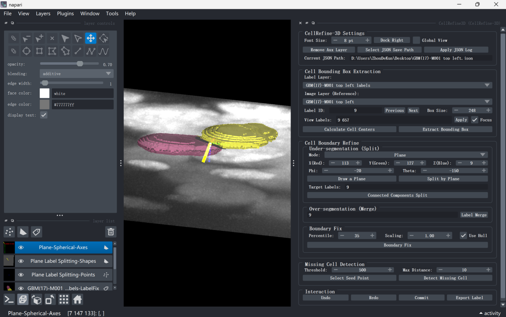
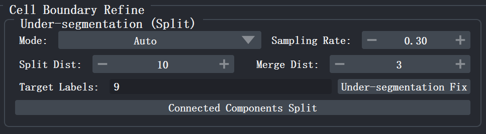
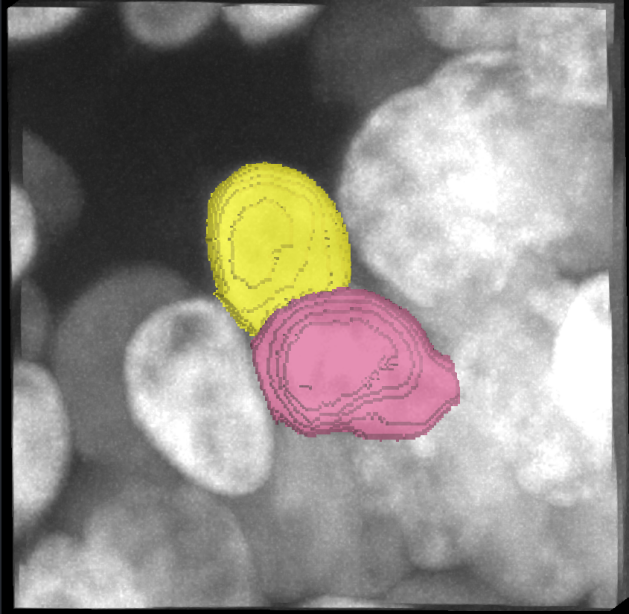
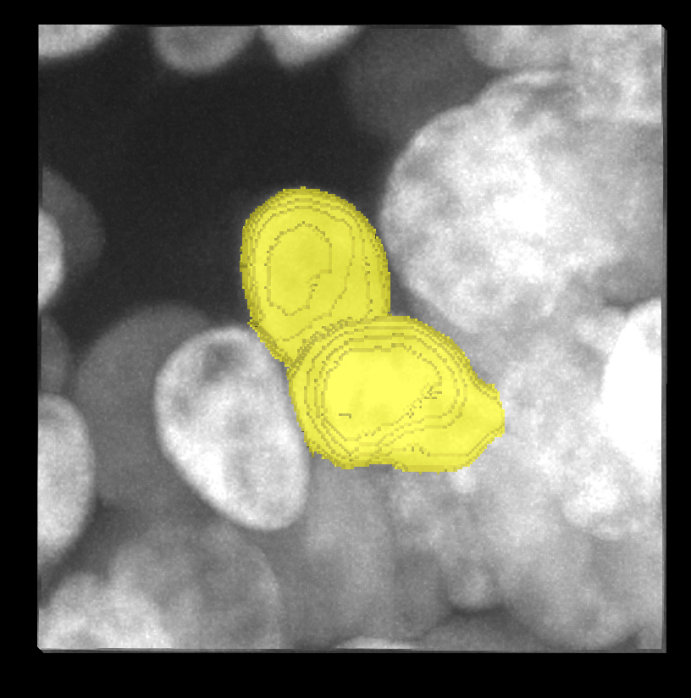
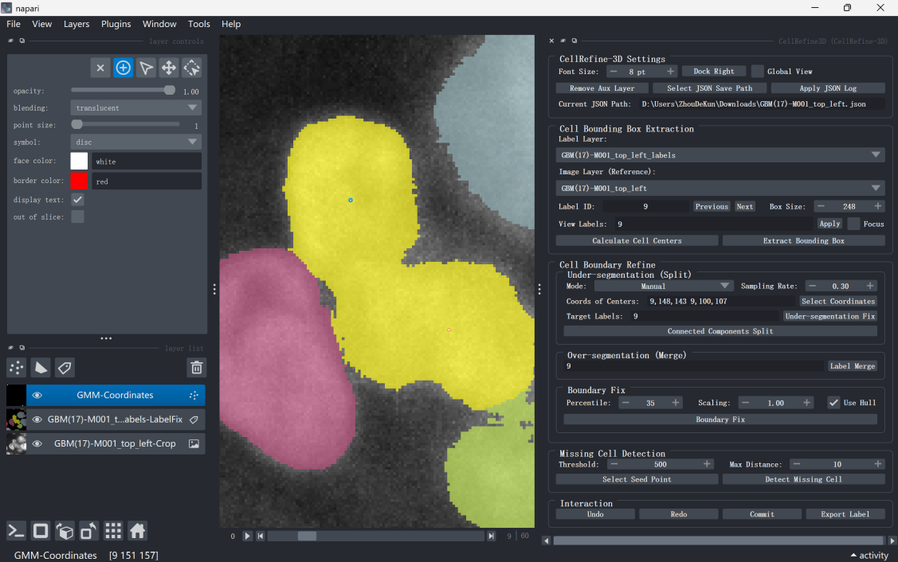
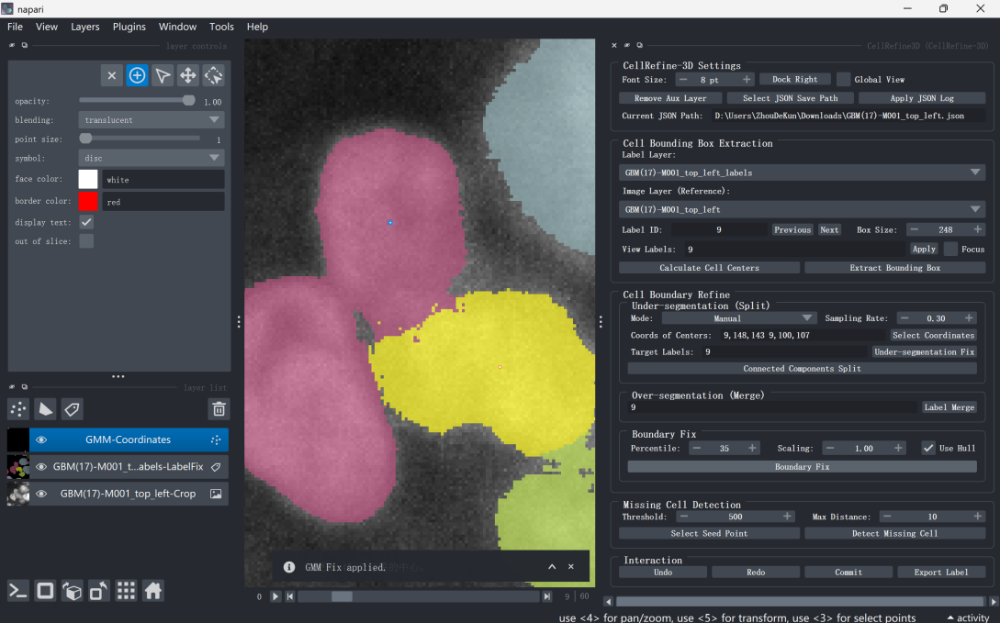

# 五、欠分割修复（Under-segmentation Split）
欠分割是指多个独立细胞被错误地标记为同一个标签。CellRefine-3D
提供三种修复模式：基于几何平面的 Plane 分割、基于高斯混合模型的 Auto
自动分裂，以及由用户指定初始中心的 Manual 手动分裂。三种模式共用同一组
Target Labels，并均可配合 Connected Components Split 进行后处理校正。

在插件面板 Cell Boundary Refine 区域的 Under-segmentation (Split)
子面板中，通过 Mode 下拉框切换模式。

  
  
图 9 Under-segmentation fix 面板

**5.1 Plane 模式（平面分割）**

适用于形态上可被某一平面清晰分离的粘连细胞。

**5.1.1设定目标标签**
在 Target Labels 输入框中填写需要分割的标签编号（空格分隔，如 114
514）。

**5.1.2初始化平面位置**
点击 Draw a Plane。若当前尚未放置平面基准点，插件会先在 napari
左下角面板中创建 Plane Label Splitting-Points
图层（蓝色点），并自动激活该图层进入添加模式，同时提示切换至 2D
视图。此时用户在目标细胞所在位置点击鼠标，插件即以此点击位置为平面经过中心，自动计算默认法向量（垂直于当前
2D 视图切片），并在面板中依次新增 Plane Label
Splitting-Shapes（深灰色半透明矩形平面与黄色法向量箭头）和
Plane-Spherical-Axes（红绿蓝虚线坐标轴）两个辅助图层，同时在 3D
视图中实时渲染出分割平面与方位参考轴。插件面板中的 X/Y/Z 与 Phi/Theta
数值框也会自动同步为当前平面参数。上述三个辅助图层用于交互式辅助定位，按快捷键
Shift + C 一键清理点、坐标、平面和图层(9.3)

**5.1.3微调平面方位**
通过 X(Red) / Y(Green) / Z(Blue) 数值框调节平面经过点的空间坐标，通过
Phi / Theta 数值框调节平面法向量的球坐标角度。每次参数变化后，3D
视图中的半透明矩形平面与黄色法向量箭头会实时更新，直至平面恰好位于两细胞之间的粘连界面。

**5.1.4执行分割**
点击 Split by
Plane。插件将位于平面法向量正方向一侧的体素赋予递增的新标签
ID，另一侧保留原标签。分割完成后，可在 2D/3D
视图中验证两细胞是否已被正确分离。

  
  
图 10 平面构建与调整

  
  
图 11 平面分割结果示例图

**5.2 Auto 模式（GMM 自动分割）**

**5.2.1设定算法参数**

• Sampling Rate：体素采样比例（默认 0.3），控制参与 GMM
训练的样本量。比例越低速度越快，比例越高精度越稳。

• Split Dist：主轴长度分裂阈值（默认
10）。当某标签内点云的主轴长度超过该值时，插件会沿主轴方向将其分裂为两个子簇。

• Merge Dist：高斯中心合并阈值（默认 3）。当两个 GMM
高斯分布的中心距离小于该值时，会被合并为一个细胞。

**5.2.2设定目标标签**
在 Target Labels
输入框中填写需要自动重分割的标签编号（空格分隔）。留空则对 bbox
内所有非零标签执行重分割。

  
  
图 12 Auto模式面板

**5.2.3执行自动分裂**
点击 Under-segmentation Fix。插件依次执行：分层采样 → GMM 聚类 →
中心合并 → 主轴分裂 → KNN 全图预测。新产生的标签 ID 从全局最大未使用 ID
开始递增，确保不与现有标签冲突。分裂完成后，插件自动更新细胞中心索引。

  

    
    
图 13 GMM 自动分割前示例

  

  
→

  

    
    
图 14 GMM 自动分割后示例

  

**5.3 Manual 模式（手动指定中心）**

**5.3.1输入或交互式选择中心坐标**
在 Coords of Centers 输入框中手动填写各细胞中心坐标，格式为
Z,Y,X（空格分隔多组，如 10,20,30 15,25,35）；或点击 Select Coordinates
按钮，插件会创建 GMM-Coordinates
图层（白色点），并自动激活该图层进入添加模式，提示切换至 2D 视图。在 2D
视图中交互式点击放置中心点，插件会自动将 Points
图层中的坐标同步到输入框，并自动识别这些点所在的标签值回填至 Target
Labels。该辅助图层不参与最终分割计算，分割后可按快捷键 Shift + C
一键清理点和图层。(9.3)

  
  
图 15 Manual模式选点示例

**5.3.2执行分裂**
点击 Under-segmentation Fix。插件以手动指定的坐标作为 GMM
初始中心，直接对 Target Labels 执行聚类与 KNN
预测，跳过自动合并与分裂步骤。

  
  
图 16 Manual选点分割结果示例

**5.4 连通域重标号（Connected Components Split）**

若分割结果中存在同一标签内部不连通的\"孤岛\"，均可点击 Connected
Components Split 进行后处理。插件会对 Target Labels
中的每个标签独立执行三维连通域分析，保留最大连通域为原标签，其余连通域按递增
ID 赋予新标签，从根本上消除同一标签跨多个物理细胞的情况。